# 1.1 課程介紹 - 課程導讀

## Nodejs的真正用途

- Nodejs, 一個javascript的運行環境

- 運行在服務器,做為 web server

- 運行在本地,做為打包，構建工具

## 學習 Nodejs 的困惑

- Nodejs 運行在服務端, 而非瀏覽器環境

- 服務端開發的思路和套路, 與前端完全不一樣

## 課程概述

- 做什麽? -- nodejs 入門到實戰, 開發個人博客系統

- 哪些部份? -- API, 數據存儲, 登錄, 日誌, 安全

- 技術? -- http stream session mysql redis nginx pm2 ...

## 知識點介紹

### 課程準備

- nodejs 介紹

- 服務端特點

- 案例分析和設計

### 原生代碼

- API和數據存儲

- 登錄和redis

- 安全和日誌

### 使用框架

- express 和 koa2

- 中間件和插件

- 中間件原理

### 線上環境

- PM2介紹和配置

- PM2多進程模型

- 服務器運維

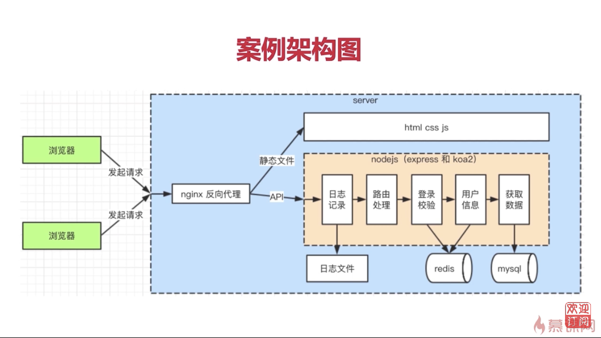

## 課程安排

- 課程準備

  - nodejs下載安裝,nodejs和javascript的區別

  - 服務端的特點, 服務端和前端的區別

  - 博客項目的需求分析和技術方案設計


- 使用原生代碼開發案例項目

  - 實現API和數據存儲, 使用 mysql 數據庫

  - 從0實現登錄, 並使用 redis 存儲登錄信息

  - 安全, 日誌記錄和日誌分析

- 使用框架開發案例項目

  - 分別使用 express 和 koa2

  - 中間件機制

  - 常用插件

  - 中間件原理

- 線上環境

  - PM2 介紹和配置

  - PM2 多進程模型

  - 關於服務器運維

## 講授方式

- 直接通過案例來學習,更能學以致用

- 先用原生代碼,再用框架和插件,先學原理再學應用

- 一個案例做三遍,更能通過對比了解框架的設計和價值

## 課程收穫

- 學會使用 nodejs 開發服務端, 成為一名後端開發人員

- 學會服務端的其他工具, mysql, redis, nginx等

- 學會服務端開發的思想, 和前端開發的區別

## 學習前提

- 熟悉 JavaScript 和 ES6 基本語法

- 用過 nodejs 和 npm 環境

- 了解 http 協議的基本內容

## 重點提示

- 只關注後端, 不講解前端

- 不會深入講解 mysql, redis 和 nginx, 但能滿足項目需求

- 不講解 vue 和 React 的 SSR

# 2.1 nodejs介紹 - 下載和安裝

## nodejs介紹

- 下載 & 安裝

- nodejs 和前端 javascript 的區別

- server 開發和前端開發的區別

## 下載安裝

- 普通方式

- 使用 nvm

## 普通方式

- 訪問官網 http://nodejs.cn 下載並且安裝

- 打開命令行 運行 node -v 和 npm -v 測試

``` bash
$ node -v
v18.15.0
```

``` bash
$ npm -v
9.5.0
```

## 使用 nvm

- nvm: nodejs 版本管理工具, 可切換多個 nodejs 版本

- mac os, 使用 brew install nvm

- windows, github中搜索 nvm-windows,有下載地址

- [nvm](https://github.com/nvm-sh/nvm)

- nvm list              查看當前所有的 node 版本

- nvm install v10.13.0  安裝指定的版本

- nvm install --lst     安裝最新 LTS version

- nvm use 18.12.1       切換到指定的版本

``` bash
$ nvm list
>     v18.12.1
      v18.16.1
        system
default -> 18.12.1 (-> v18.12.1)
iojs -> N/A (default)
unstable -> N/A (default)
node -> stable (-> v18.16.1) (default)
stable -> 18.16 (-> v18.16.1) (default)
lts/* -> lts/hydrogen (-> v18.16.1)
lts/argon -> v4.9.1 (-> N/A)
lts/boron -> v6.17.1 (-> N/A)
lts/carbon -> v8.17.0 (-> N/A)
lts/dubnium -> v10.24.1 (-> N/A)
lts/erbium -> v12.22.12 (-> N/A)
lts/fermium -> v14.21.3 (-> N/A)
lts/gallium -> v16.20.1 (-> N/A)
lts/hydrogen -> v18.16.1
```

``` bash
$ nvm install v10.15.0
$ nvm use  18.16.1
Now using node v18.16.1 (npm v9.5.1)
$ node -v
v18.16.1
```

## 總結

- 如果你需要同時使用多個 node 版本, 推薦用 nvm

- 無論用哪種方式,必須安裝好 node, 版本要 >= 8.0

# 2.2 nodejs 介紹 | nodejs和js的區別

## nodejs和js的區別

- ECMAScript

- javascript

- nodejs

### ECMAScript

- 定義了語法,寫 javascript 和 nodejs 都必須遵守

- 變量定義, 循環, 判斷, 函數

- 原型和原型鍊, 作用域和閉包, 異步

- 具體內容可參考 http://es6.ruanyifeng.com/ 阮一峰 的 ECMAScript 6 入門

- 不能操作 DOM,不能監聽 click 事件,不能發送 ajax 請求

- 不能處理 http 請求, 不能操作文件

- 即 ,只有ECMAScript, 幾乎做不了任何實際的項目

### javascript

- 使用 ECMAScript 語法規範, 外加 Web API, 缺一不可

- DOM操作, BOM操作, 事件綁定, Ajax 等

- 兩者結合, 即可完成瀏覽器端的任何操作

### nodejs

- 使用 ECMAScript 語法規範,外加 nodejs API, 缺一不可

- 處理 http, 處理文件等, 具體參考 http://nodejs.cn/api/

- 兩者結合, 即可完成 server 端的任何操作

## 總結

- ECMAScript 是語法規範

- nodejs = ECMAScript + nodejs API

## 補充

- commonjs 模塊化

- nodejs debugger

# 2.3 nodejs 介绍 | commonjs 演示

``` bash
$ mkdir commonjs-test
$ cd commonjs-test
$ ll
total 16
drwxrwxr-x 2 ray ray 4096 Jul 12 22:59 ./
drwxrwxr-x 4 ray ray 4096 Jul 12 22:58 ../
-rw-r--r-- 1 ray ray    0 Jul 12 22:59 a.js
-rw-r--r-- 1 ray ray    0 Jul 12 22:59 b.js
```

``` js a.js
function add(a, b) {
    return a + b
}

module.exports = add
```

``` js b.js
const add = require('./a')
const sum = add(10, 20)
console.log(sum)
```

``` bash
$ node b.js
30
```

``` js a.js
function add(a, b) {
    return a + b
}

function mul(a, b) {
    return a * b
}

module.exports = {
    add,
    mul
}
```

``` js b.js
const { add, mul } = require('./a')
const sum = add(10, 20)
const result = mul(100, 200)

console.log(sum)
console.log(result)
```

``` bash
$ node b.js
30
20000
```

``` js
const { add, mul } = require('./a')
```

上面的寫法,完全等同於下面的寫法

``` js
const opts = require('./a')
const add = opts.add
const mul = opts.mul
```

``` bash
$ npm init -y
Wrote to /home/ray/Projects/nodejs/Nodejs從零開發WebServer博客項目/commonjs-test/package.json:

{
  "name": "commonjs-test",
  "version": "1.0.0",
  "description": "",
  "main": "a.js",
  "scripts": {
    "test": "echo \"Error: no test specified\" && exit 1"
  },
  "keywords": [],
  "author": "",
  "license": "ISC"
}
```

安裝 lodash

``` bash
$ npm i lodash --save
```

 原使用淘寶鏡像安裝, 現已改名為 https://npmmirror.com/

``` bash
$ npm i lodash --save --registry=https://registry.npm.taobao.org
```

``` bash
$ npm i lodash --save --registry=https://registry.npmmirror.com
```

修改 `b.js`
``` js b.js
const { add, mul } = require('./a')
const _ = require('lodash')

const sum = add(10, 20)
const result = mul(100, 200)

console.log(sum)
console.log(result)

const arr = _.concat([1, 2], 3)
console.log('arr...', arr)
```

``` bash
$ node b.js
30
20000
arr... [1, 2, 3]
```

# 2.4 nodejs 介绍 | debugger

``` bash
$ mkdir debugger-test
$ cd debugger-test
$ npm init -y
Wrote to /home/ray/Projects/nodejs/Nodejs從零開發WebServer博客項目/debugger-test/package.json:

{
  "name": "debugger-test",
  "version": "1.0.0",
  "description": "",
  "main": "index.js",
  "scripts": {
    "test": "echo \"Error: no test specified\" && exit 1"
  },
  "keywords": [],
  "author": "",
  "license": "ISC"
}
```

將 `index.js` 改名為 `app.js`, `package.json` 內 main 的檔名要和外部的檔名一致

``` js app.js
console.log(100)
console.log(200)
console.log(300)
console.log(400)
console.log(500)
console.log(600)
```

改成比較複雜的例子

``` js app.js
const http = require('http')

const server = http.createServer((req, res) => {
    res.writeHead(200, {'content-type': 'text/html'})
    res.end('<h1>Hello World</h1>')
})

server.listen(3000, ()=> {
    console.log('listening on port 3000')
})
```

# 2.5 nodejs 介绍 | server端和前端的区别

## server開發和前端開發的區別

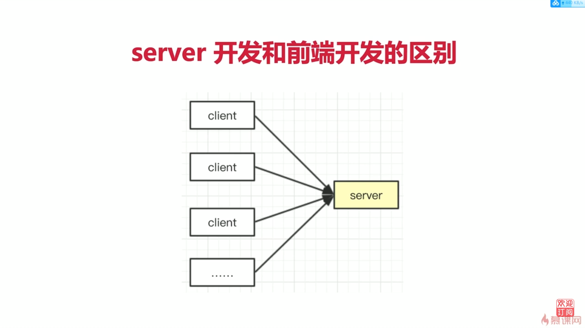

- 服務穩定性

- 考慮內存和CPU(優化,擴展)

- 日誌記錄

- 安全

- 集群和服務拆分

### 服務穩定性

- Server端可能會遭受各種惡意攻擊和誤操作

- 單個客戶端可以意外掛掉,但是服務端不能

- 課程後面會講解使用 PM2 做進程守候

### 考慮內存和CPU(優化,擴展)

- 客戶端獨占一個瀏覽器, 內存和CPU都不是問題

- Server端要承載很多請求, CPU和內存都是稀缺資源

- 課程後面會講解使用 stream 寫日誌, 使用 redis 存 session

### 日誌記錄

- 前端也會參與寫日誌,但只是日誌的發起方,不關心後續

- Server端要記錄日誌, 存儲日誌, 分析日誌, 前端不關心

- 課程後面會講解多種日誌記錄方式, 以及如何分析日誌

### 安全

- Server端要隨時準備接收各種惡意攻擊, 前端則少很多

- 如: 越權操作, 數據庫攻擊等

- 課程後面會講解登錄驗證, 預防 xss 攻擊和 sql 注入

### 集群和服務拆分

- 產品發展速度快, 流量可能會迅速增加

- 如何通過擴展機器和服務拆分來承載大流量?

- 本課程雖然是單機器開發, 但是從設計上支持服務拆分

### 總結

- 本節列出的幾點區別

- 將如何在 nodejs 中解決

# 2.6 nodejs 介绍 | 总结

- nodejs 下載安裝, 兩種方式
- nodejs和前端 javascript 的區別, commonjs 和 debugger
- server 開發和前端開發的區別, 重點在於切換思路

# 3.1 项目介绍 | 项目需求分析

## 博客項目介紹

- 目標

- 需求

- 技術方案

## 目標

- 開發一個博客系統, 具有博客的基本功能

- 只開發 server 端, 不關心前端

## 需求

- 首頁, 作者主頁, 博客詳情頁

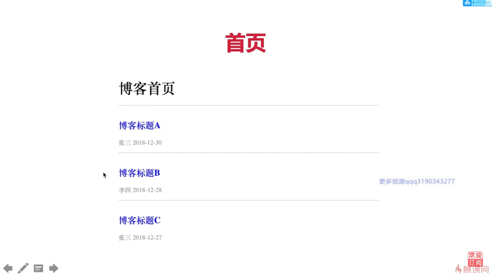

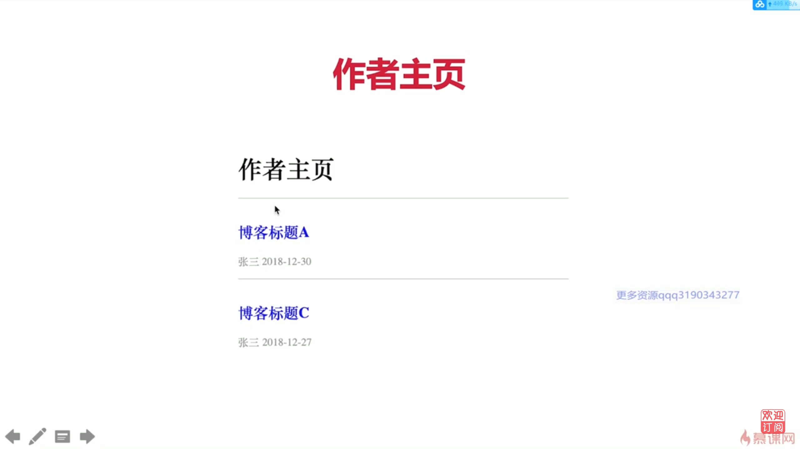

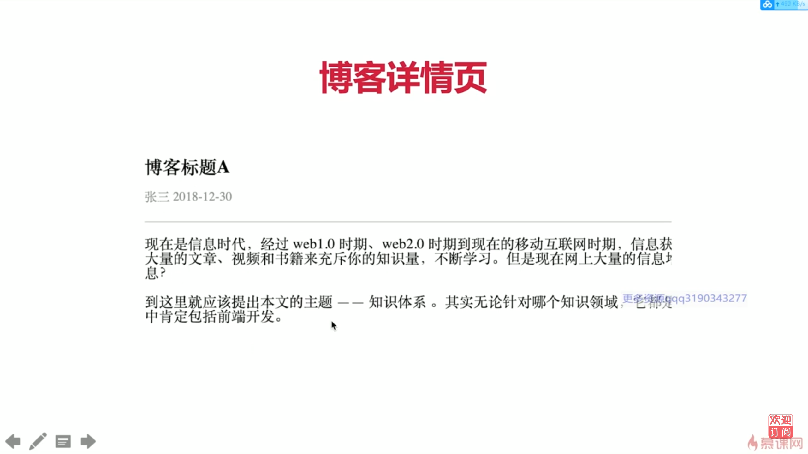

- 登錄頁

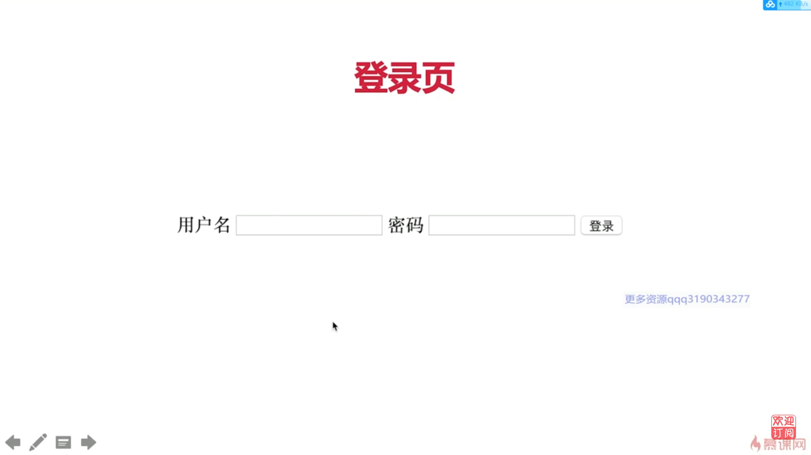

- 管理中心, 新建頁, 編輯頁

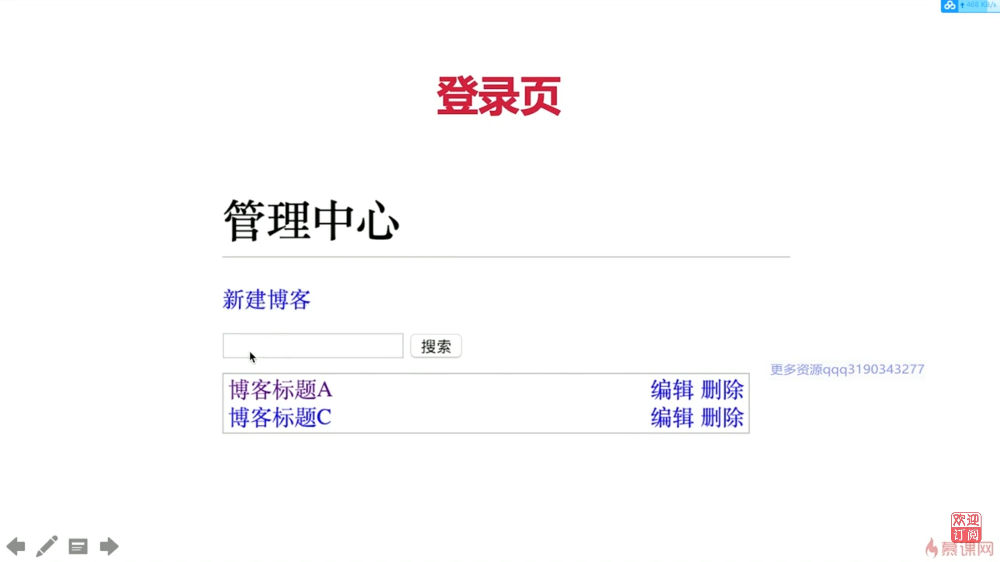

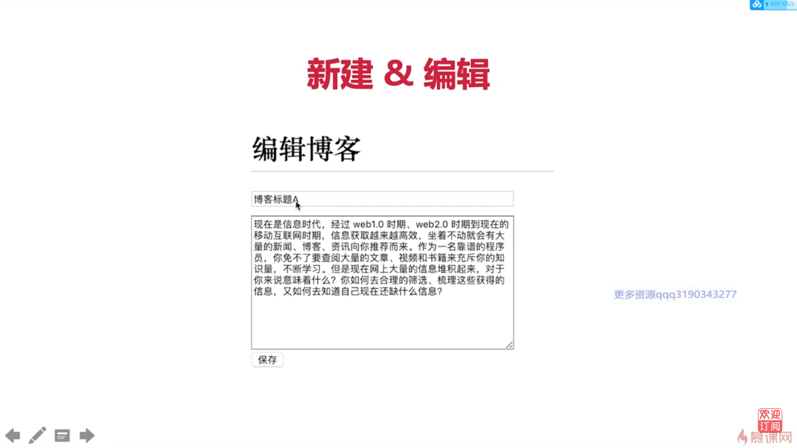

## 技術方案

## 總結

- 需求一定要明確, 需求指導開發

- 不要糾結於簡單的頁面樣式, 並不影響 server 端的複雜度

# 3.2 项目介绍 | 技术方案

## 技術方案

- 數據如何存儲

- 如何與前端對接, 即接口設計

## 數據存儲

- 博客

- 用戶

## 存儲博客

| id | title | content | createtime    | author   |
|----|------|---------|---------------| ---|
| 1  | 標題1 | 內容1   | 1542512972176 | zhangsan |
| 2  | 標題2 | 內容2   | 1542512972662 | lisi     |

## 存儲用戶

| id | username | password | realname |
|----|------|---------|---------------|
| 1  | zhangsan | 123      | 張三     |
| 2  | lisi     | 123      | 李四     |

## 接口設計

| 描述               | 接口             | 方法 | url參數                        | 備註                           |
|--- |--- |--- | -- |-- |
| 獲取博客列表       | /api/blog/list   | get  | author作者, keyword 搜索關鍵字 | 參數為空的話, 則不進行查詢過濾 |
| 獲取一篇博客的內容 | /api/blog/detail | get  | id  　| 
| 新增一篇博客       | /api/blog/new    | post |                                | post 中有新增的信息            |
| 更新一篇博客       | /api/blog/update    | post |                                | postData 中有更新的內容            |
| 刪除一篇博客       | /api/blog/delete    | post |                                |             |
| 登錄 | /api/user/login | post | | postData 中有用戶名和密碼 |

## 登錄

- 業界有統一的解決方案, 一般不用再重新設計

- 實現起來比較複雜, 課程後面會講解

## 總結

- 細節看不懂, 可以不用深究, 繼續往下看

- 但是要明白 "存儲" 和 "接口" 的概念和用途

# 4.1 开发博客项目之接口 | http 概述

## 開發接口(不用任何框架)

- nodejs 處理 http 請求

- 搭發開發環境

- 開發接口(暫不連接數據庫, 暫不考慮登錄)

## http 請求概述

- DNS 解析, 建立 TCP 連接, 發送 http 請求

- server 接收到 http 請求, 處理, 並返回

- 客戶端接收到返回數據, 處理數據(如渲染頁面, 執行js)

## 實例演示

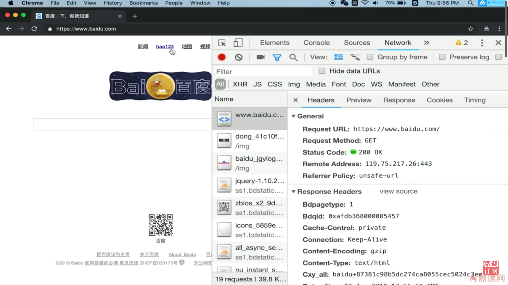

瀏覽器輸入 `https://www.baidu.com/` ,經過 `dns` 域名解析,得到對應的IP地址 `119.75.217.26:443` , 進行 TCP 連接(3次握手),之後發送 http 請求, 服務器端接收請求,處理並返回   `Response` , 其中 `content-type: text/html` 表示返回一個html, 客戶端接收返回數據, 進行渲染頁面等.

# 4.2 开发博客项目之接口 | 处理get请求

## nodejs 處理 http 請求

- get 請求和 querystring

- post 請求和 postdata

- 路由

## 簡單示例

``` js
const http = require('http');

const server = http.createServer((req, res) => {
  res.end('hello world');
});
server.listen(8000);

// 然後瀏覽器訪問 http://localhost:8000/
```

## nodejs 處理 get 請求

- get 請求, 即客戶端要向 server 端獲取數據, 如查詢博客列表

- 通過 querystring 來傳遞數據, 如 a.html?a=100&b=200

- 瀏覽器直接訪問, 就發送 get 請求

``` js
const http = require('http');
const querystring = require('querystring');

const server = http.createServer((req, res) => {
  console.log(req.method) // GET
  const url = req.url     // 獲取請求的完整 url
  req.query = querystring.parse(url.split('?')[1])   //解析 querystring
  res.end(JSON.stringify(req.query)) // 將 querystring 返回
})
server.listen(8000);
```

``` bash
$ node app.js

OK
```

瀏覽器輸入 `http://localhost:8000` , 瀏覽器上顯示 `{ }`

``` bash
method:  GET
url:  /
query:  [Object: null prototype] {}
```

瀏覽器輸入 `http://localhost:8000/api/blog/list`, 瀏覽器上顯示 `{ }`

``` bash
method:  GET
url:  /api/blog/list
query:  [Object: null prototype] {}
```

瀏覽器輸入 `http://localhost:8000/api/blog/list?author=zhangshan&keyword=A`, 瀏覽器上顯示 `{"author":"zhangshan","keyword":"A"}`

``` bash
method:  GET
url:  /api/blog/list?author=zhangshan&keyword=A
query:  [Object: null prototype] { author: 'zhangshan', keyword: 'A' }
```

# 4.3 开发博客项目之接口 | 处理post请求

## nodejs 處理 post 請求

- post 請求, 即客戶端要向服務端傳遞數據, 如新建博客

- 通過 post data 傳遞數據, 後面會演示

- 瀏覽器無法直接模擬, 需要手寫 js, 或者使用 postman

## 安裝 postman

## nodejs 處理 post 請求

``` js
const http = require('http')

const server = http.createServer((req, res) => {
    if (req.method === 'POST') {
        // 數據格式
        console.log('content-type', req.headers['content-type'])
        // 接收數據
        let postData = ""
        req.on('data', chunk => {
            postData += chunk.toString()
        })
        req.on('end', () => {
            console.log(postData)
            res.end('hello world') // 在這裡返回, 因為是異步
        })
    }
});
server.listen(8000);
```
## 代碼演示

### 使用 postman 發送post請求

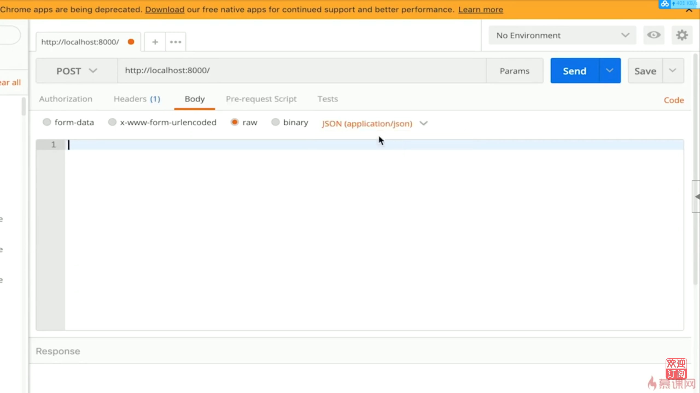

1. 輸入 `http://localhost:8000`
2. 選擇 `POST`
3. Body選擇 `raw` -> `JSON`

### 使用 curl 發送post請求

在client端使用 `curl` 命令發送post請求

``` bash
curl -X POST -H "Content-Type: application/json" http://localhost:8000
```

### nodejs 處理 post 請求

當server端收到post請求,會顯示下面結果

``` bash
$ node app.js
req content-type:  application/json
postData:  
```

### 使用 postman 發送post請求,並指定json內容

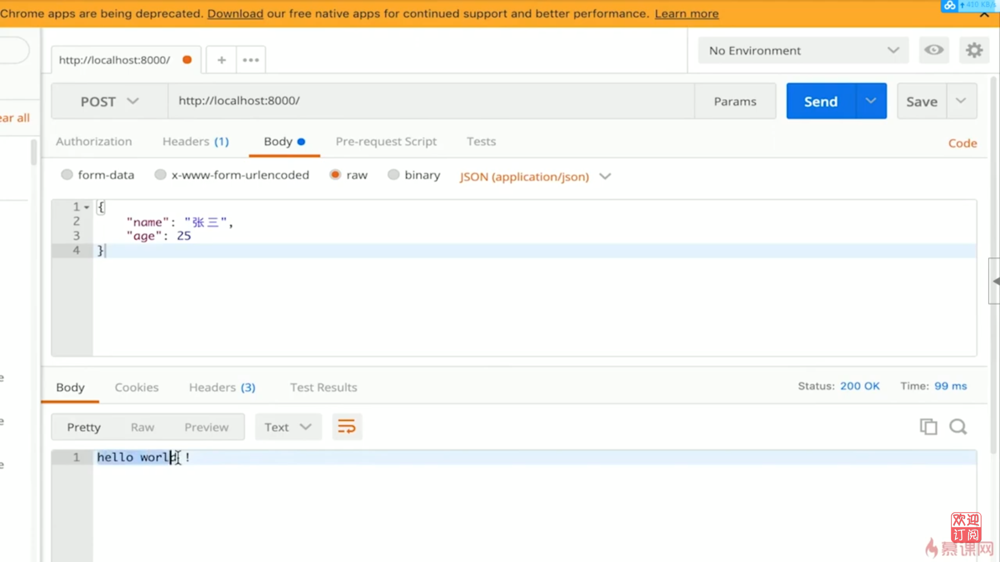

1. 輸入 `http://localhost:8000`
2. 選擇 `POST`
3. Body選擇 `raw` -> `JSON`
4. 輸入 { "name": "張三", "age": 25 }

### 使用 curl 發送post請求,並指定json內容

在client端使用 `curl` 命令發送post請求

``` bash
curl -X POST -H "Content-Type: application/json" "http://localhost:8000" -d '{"name":"張三", "age":"25"}'
```

### nodejs 處理 post (含json內容) 請求

當server端收到post請求,會顯示下面結果

``` bash
$ node app.js
req content-type:  application/json
postData:  {"name":"張三", "age":"25"}
```

## nodejs 處理路由

- https://github.com/

- https://github.com/username

- https://github.com/username/xxx

``` js
const http = require('http')

const server = http.createServer((req, res) => {
    const url = req.url
    const path = url.split('?')[0]
    res.end(path)   //返回路由
});
server.listen(8000);
```