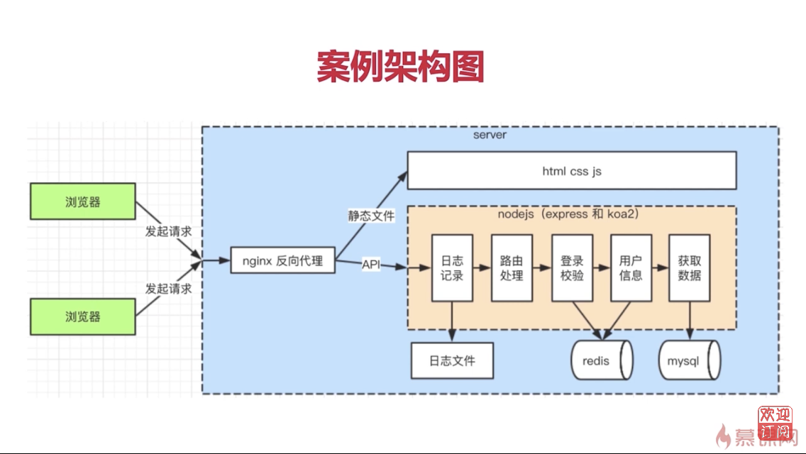

# 1.1 課程介紹 - 課程導讀

## Nodejs的真正用途

- Nodejs, 一個javascript的運行環境

- 運行在服務器,做為 web server

- 運行在本地,做為打包，構建工具

## 學習 Nodejs 的困惑

- Nodejs 運行在服務端, 而非瀏覽器環境

- 服務端開發的思路和套路, 與前端完全不一樣

## 課程概述

- 做什麽? -- nodejs 入門到實戰, 開發個人博客系統

- 哪些部份? -- API, 數據存儲, 登錄, 日誌, 安全

- 技術? -- http stream session mysql redis nginx pm2 ...

## 知識點介紹

### 課程準備

- nodejs 介紹

- 服務端特點

- 案例分析和設計

### 原生代碼

- API和數據存儲

- 登錄和redis

- 安全和日誌

### 使用框架

- express 和 koa2

- 中間件和插件

- 中間件原理

### 線上環境

- PM2介紹和配置

- PM2多進程模型

- 服務器運維

## 課程安排

- 課程準備

  - nodejs下載安裝,nodejs和javascript的區別

  - 服務端的特點, 服務端和前端的區別

  - 博客項目的需求分析和技術方案設計

- 使用原生代碼開發案例項目

  - 實現API和數據存儲, 使用 mysql 數據庫

  - 從0實現登錄, 並使用 redis 存儲登錄信息

  - 安全, 日誌記錄和日誌分析

- 使用框架開發案例項目

  - 分別使用 express 和 koa2

  - 中間件機制

  - 常用插件

  - 中間件原理

- 線上環境

  - PM2 介紹和配置

  - PM2 多進程模型

  - 關於服務器運維

## 講授方式

- 直接通過案例來學習,更能學以致用

- 先用原生代碼,再用框架和插件,先學原理再學應用

- 一個案例做三遍,更能通過對比了解框架的設計和價值

## 課程收穫

- 學會使用 nodejs 開發服務端, 成為一名後端開發人員

- 學會服務端的其他工具, mysql, redis, nginx等

- 學會服務端開發的思想, 和前端開發的區別

## 學習前提

- 熟悉 JavaScript 和 ES6 基本語法

- 用過 nodejs 和 npm 環境

- 了解 http 協議的基本內容

## 重點提示

- 只關注後端, 不講解前端

- 不會深入講解 mysql, redis 和 nginx, 但能滿足項目需求

- 不講解 vue 和 React 的 SSR
