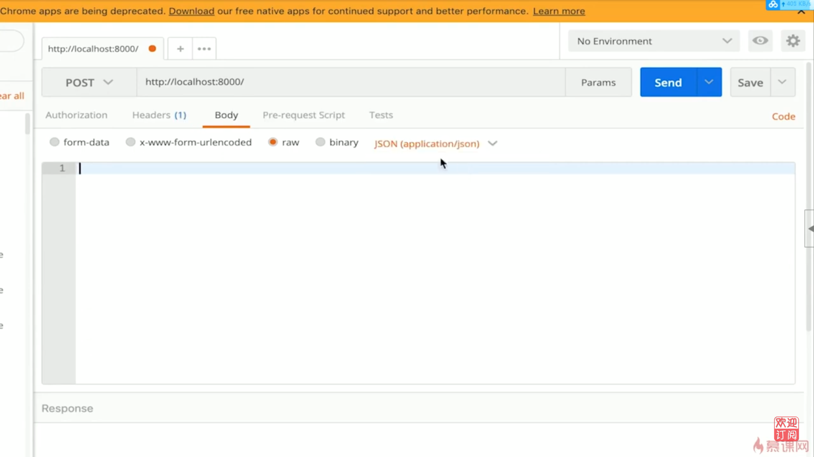
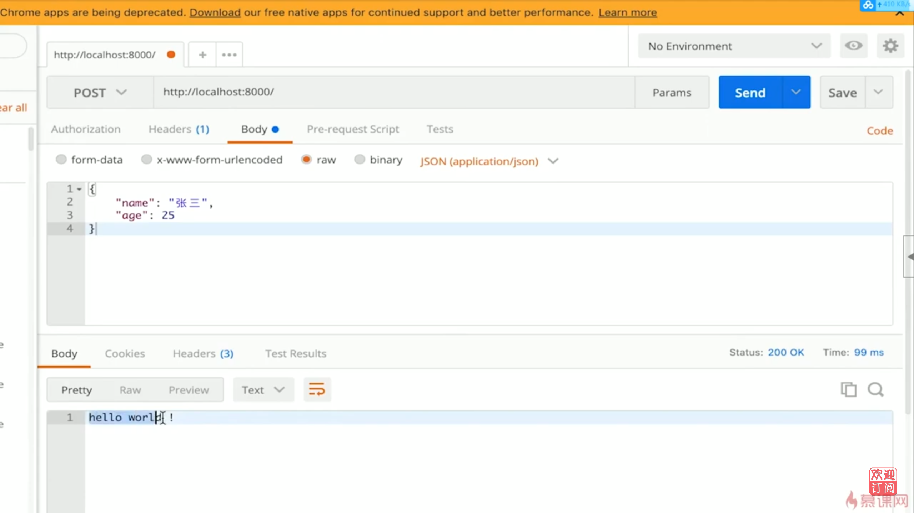

# 4.3 开发博客项目之接口 | 处理post请求

## nodejs 處理 post 請求

- post 請求, 即客戶端要向服務端傳遞數據, 如新建博客

- 通過 post data 傳遞數據, 後面會演示

- 瀏覽器無法直接模擬, 需要手寫 js, 或者使用 postman

## 安裝 postman

## nodejs 處理 post 請求

``` js
const http = require('http')

const server = http.createServer((req, res) => {
    if (req.method === 'POST') {
        // 數據格式
        console.log('content-type', req.headers['content-type'])
        // 接收數據
        let postData = ""
        req.on('data', chunk => {
            postData += chunk.toString()
        })
        req.on('end', () => {
            console.log(postData)
            res.end('hello world') // 在這裡返回, 因為是異步
        })
    }
});
server.listen(8000);
```
## 代碼演示

### 使用 postman 發送post請求



1. 輸入 `http://localhost:8000`
2. 選擇 `POST`
3. Body選擇 `raw` -> `JSON`

### 使用 curl 發送post請求

在client端使用 `curl` 命令發送post請求

``` bash
curl -X POST -H "Content-Type: application/json" http://localhost:8000
```

### nodejs 處理 post 請求

當server端收到post請求,會顯示下面結果

``` bash
$ node app.js
req content-type:  application/json
postData:
```

### 使用 postman 發送post請求,並指定json內容



1. 輸入 `http://localhost:8000`
2. 選擇 `POST`
3. Body選擇 `raw` -> `JSON`
4. 輸入 { "name": "張三", "age": 25 }

### 使用 curl 發送post請求,並指定json內容

在client端使用 `curl` 命令發送post請求

``` bash
curl -X POST -H "Content-Type: application/json" "http://localhost:8000" -d '{"name":"張三", "age":"25"}'
```

### nodejs 處理 post (含json內容) 請求

當server端收到post請求,會顯示下面結果

``` bash
$ node app.js
req content-type:  application/json
postData:  {"name":"張三", "age":"25"}
```

## nodejs 處理路由

- https://github.com/

- https://github.com/username

- https://github.com/username/xxx

``` js
const http = require('http')

const server = http.createServer((req, res) => {
    const url = req.url
    const path = url.split('?')[0]
    res.end(path)   //返回路由
});
server.listen(8000);
```
