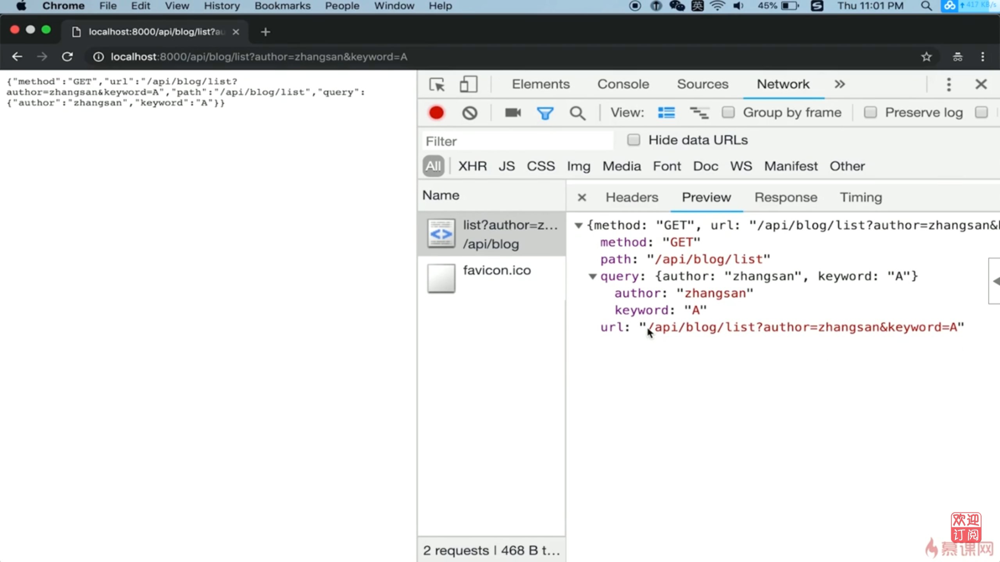
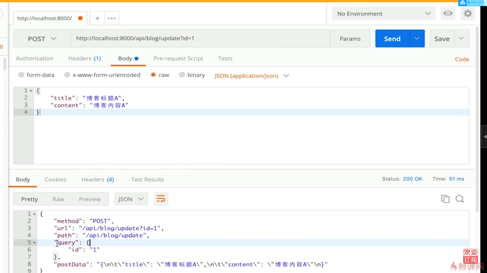

# 4.4 开发博客项目之接口 | 处理http请求的综合示例

## 综合示例

app.js

``` js
const http = require('http');
const querystring = require('querystring');

const server = http.createServer((req, res) => {
    const method = req.method
    const url = req.url
    const path = url.split('?')[0]
    const query = querystring.parse(url.split('?')[1])

    // 設置返回格式為 JSON
    res.setHeader('Content-type', 'application/json')

    // 返回的數據
    const resData = {
        method,
        url,
        path,
        query
    }

    // 返回
    if (method === 'GET') {
        res.end(
            JSON.stringify(resData)
        )
    }
    if (method === 'POST') {
        let postData = ''
        req.on('data', chunk => {
            postData += chunk.toString()
        })
        req.on('end', () => {
            resData.postData = postData
            // 返回
            res.end(
                JSON.stringify(resData)
            )
        })
    }
});

server.listen(8000);
console.log('OK')
```

運行程序

``` bash
$ node app.js
```
get 請求



post 請求

``` bash
$ curl -X POST -H "Content-Type: application/json" http://localhost:8000/api/blog/update?id=1 -d '{"title":"博客標題", "contet":"博客}內容A}'
```


