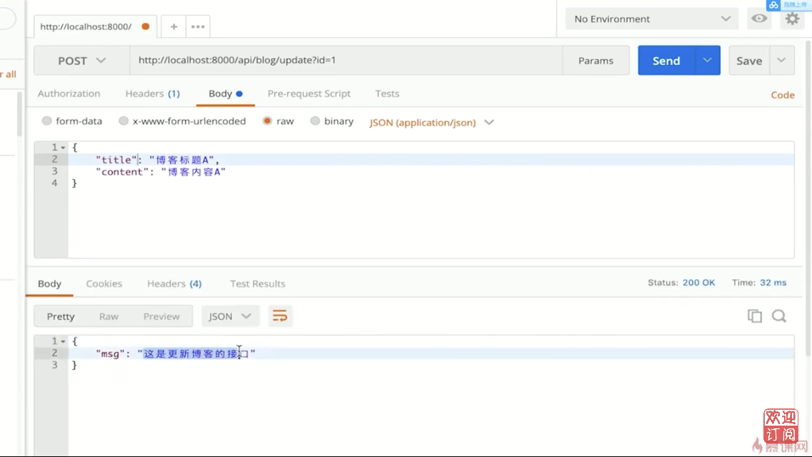

# 4.6 开发博客项目之接口 | 初始化路由

## 開發接口

- 初始化路由:根據之前技術方案的設計,做出路由

- 返回假數據:將路由和數據處理分離,以符合設計原則

## 接口設計

接口設計

| 描述               | 接口             | 方法 | url參數                        | 備註                           |
|--- |--- |--- | -- |-- |
| 獲取博客列表       | /api/blog/list   | get  | author作者, keyword 搜索關鍵字 | 參數為空的話, 則不進行查詢過濾 |
| 獲取一篇博客的內容 | /api/blog/detail | get  | id  　|
| 新增一篇博客       | /api/blog/new    | post |                                | post 中有新增的信息            |
| 更新一篇博客       | /api/blog/update    | post |                                | postData 中有更新的內容            |
| 刪除一篇博客       | /api/blog/delete    | post |                                |             |
| 登錄 | /api/user/login | post | | postData 中有用戶名和密碼 |

## 代碼演示

在blog-1資料夾下,新增資料夾src,在src資料夾下再新增資料夾router

``` bash
$ cd blog-1
$ mkdir -p src\router 
```

在router資料夾下新增blog.js和user.js

`blog.js`

``` js
const handleBlogRouter = (req, res) => {
    const method = req.method
    const url = req.url
    const path = url.split('?')[0]

    // 獲取博客列表
    if(method === 'GET' && path === '/api/blog/list') {
        return {
            msg: '這是獲取博客列表的接口'
        }
    }

    // 獲取博客詳情
    if(method === 'GET' && path === '/api/blog/detail') {
        return {
            msg: '這是獲取博客詳情的接口'
        }
    }

    // 新建一篇博客
    if(method === 'POST' && path === '/api/blog/new') {
        return {
            msg: '這是新建博客的接口'
        }
    }

    // 更新一篇博客
    if(method === 'POST' && path === '/api/blog/update') {
        return {
            msg: '這是更新博客的接口'
        }
    }

    // 刪除一篇博客
    if(method === 'POST' && path === '/api/blog/delete') {
        return {
            msg: '這是刪除博客的接口'
        }
    }
}

module.exports = handleBlogRouter
```

`user.js`

``` js
const handleUserRouter = (req, res) => {
    const method = req.method
    const url = req.url
    const path = url.split('?')[0]

    if(method === 'POST' && path === '/api/user/login') {
        return {
            msg: '這是登錄的接口'
        }
    }
}

module.exports = handleUserRouter
```

修改 app.js

`app.js`

``` js
const handleBlogRouter = require('./src/router/blog')
const handleUserRouter = require('./src/router/user')

const serverHandle = (req, res) => {
    // 設置返回格式 JSON
    res.setHeader('Content-type', 'application/json')

    // 處理 blog 路由
    const blogData = handleBlogRouter(req, res)
    if(blogData) {
        res.end(
            JSON.stringify(blogData)    
        )
        return
    }

    // 處理 user 路由
    const userData = handleUserRouter(req, res)
    if(userData) {
        res.end(
            JSON.stringify(userData)
        )
        return
    }

    // 未命中路由, 返回 404   
    res.writeHead(404, {'Content-type': 'text/plain'})
    res.write("404 Not Found\n")
    res.end()
}

module.exports = serverHandle
```

運行程序

``` bash
$ node bin\www.js
```

或者

``` bash
$ node run dev
```

## 驗證

### 瀏覽器驗證 get

瀏覽器網址列輸入 `http://localhost:8000/api/blog/list?keyword=標題`


瀏覽器網址列輸入 `http://localhost:8000/api/blog/detail?id=1`


### Postman驗證 post

Postman網址列輸入 `http://localhost:8000/api/blog/update`




Postman網址列輸入 `http://localhost:8000/api/user/login`


## 代碼重構

將 `const url = req.url` , `const path = url.split('?')[0]` 抽取至 `app.js`, 並將其存在req.path內,不必每個地方都寫一次,使用時統一用 `req.path`

