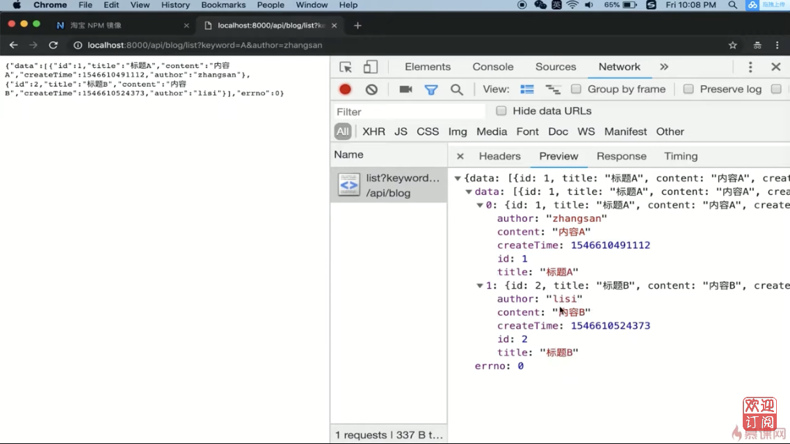

# 4.7 开发博客项目之接口 | 开发路由（博客列表路由）

## 代碼演示

在 src 資料夾下新增資料夾 model

``` bash
$ mkdir -p src/model
```

在 model 資料夾下新增 resModel.js

`resModel.js`

``` js
class BaseModel {
    constructor(data, message) {
        if (typeof data === 'string') {
            this.message = data
            data = null
            message = null
        }
        if (data) {
            this.data = data
        }
        if (message) {
            this.message = message
        }
    }
}

class SuccessModel extends BaseModel {
    constructor(data, message) {
        super(data, message)
        this.errno = 0
    }
}

class ErrorModel extends BaseModel {
    constructor(data, message) {
        super(data, message)
        this.errno = -1
    }
}

module.exports = {
    SuccessModel,
    ErrorModel
}
```

修改 app.js 增加解析 querystring

`app.js`

``` js
const querystring = require('querystring')
```

``` js
// 解析 query
req.query = querystring.parse(url.split('?')[0])
```

建立 controller 資料夾

``` bash
$ mkdir -p src\controller
cd src\controller
```

建立 blog.js

``` js
const getList = (author, keyword) => {
    // 先返回假數據 (格式是正確的)
    return [
        {
            id: 1,
            title: '標題A',
            content: '內容A',
            createTime: 1546610491112,
            author: 'zhangsan'
        },
        {
            id: 2,
            title: '標題B',
            content: '內容B',
            createTime: 1546610524373,
            author: 'lisi'            
        }
    ]
}

module.exports = { 
    getList 
}
```

修改 router\blog.js

``` js
const { getList } = require('../controller/blog')
const { SuccessModel, ErrorModel } = require('../model/resModel')

const handleBlogRouter = (req, res) => {
    const method = req.method

    // 獲取博客列表
    if(method === 'GET' && req.path === '/api/blog/list') {
        const author = req.query.author || ''
        const keyword = req.query.keyword || ''
        const listData = getList(author, keyword)
        return new SuccessModel(listData)
    }

    // 獲取博客詳情
    if(method === 'GET' && req.path === '/api/blog/detail') {
        return {
            msg: '這是獲取博客詳情的接口'
        }
    }

    // 新建一篇博客
    if(method === 'POST' && req.path === '/api/blog/new') {
        return {
            msg: '這是新建博客的接口'
        }
    }

    // 更新一篇博客
    if(method === 'POST' && req.path === '/api/blog/update') {
        return {
            msg: '這是更新博客的接口'
        }
    }

    // 刪除一篇博客
    if(method === 'POST' && req.path === '/api/blog/delete') {
        return {
            msg: '這是刪除博客的接口'
        }
    }
}

module.exports = handleBlogRouter
```

開啟瀏覽器, 地址列輸入 http://localhost:8000/api/blog/list



