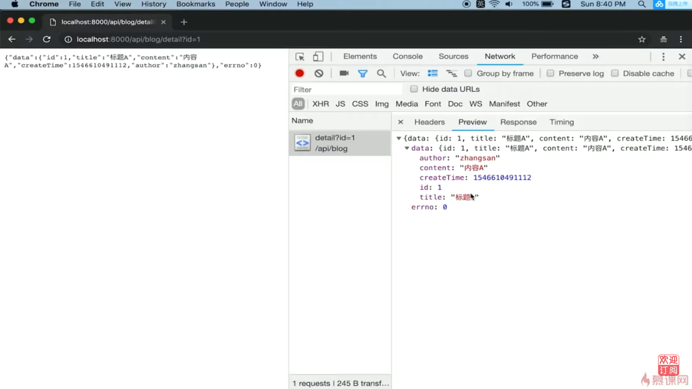

# 4.8 开发博客项目之接口 | 开发路由（博客详情路由）

## 代碼演示

修改 controller\blog.js, 增加 getDetail 

`rcontroller\blog.js`

``` js
const getDetail = (id) => {
    // 先返回假數據
    return  {
        id: 1,
        title: '標題A',
        content: '內容A',
        createTime: 1546610491112,
        author: 'zhangsan'
    }
}

module.exports = { 
    getList,
    getDetail 
}
```

修改 router\blog.js 引入 getDetail, 並修改獲取博客詳情邏輯

`router\blog.js`

``` js
const { getList, getDetail } = require('../controller/blog')
```

`router\blog.js`

``` js
if(method === 'GET' && req.path === '/api/blog/detail') {
    const id = req.query.id 
    const detailData = getDetail(id)
    return new SuccessModel(detailData)
}
```

開啟瀏覽器, 地址列輸入 http://localhost:8000/api/blog/detail?id=1



## Promise 

新增 `promise-test` 資料夾, 底下再新增 `files` 資料夾, 在分別建立 `a.json`, `b.json`, `c.json` 三個檔案.

`a.json`

``` json
{
    "next": "b.json",
    "msg": "this is a"
}
```

`b.json`

``` js
{
    "next": "c.json",
    "msg": "this is b"
}
```

`c.json`

``` js
{
    "next": null,
    "msg": "this is c"
}
```

在 `promise-test` 資料夾下新增一個檔案 `index.js`,內容如下

``` js
const fs = require('fs')
const path = require('path')

const fullFileName = path.resolve(__dirname, 'files', 'a.json')
fs.readFile(fullFileName, (err, data) => {
    if (err) {
        console.error(err)
        return
    }
    console.log(data.toString())
})
```

執行 `index.js`

``` bash
$ node index.js
{
    "next": "b.json",
    "msg": "this is a"
}
```

用 `callback` 方式獲取一個文件內容

``` js
function getFileContent(fileName, callback) {
    const fullFileName = path.resolve(__dirname, 'files', fileName)
    fs.readFile(fullFileName, (err, data) => {
        if (err) {
            console.error(err)
            return
        }
        callback(
            JSON.parse(data.toString())
        )
    })
}

// 測試
getFileContent('a.json', aData => {
    console.log('a data', aData)
}) 
```

測試

``` bash
$ node index.js
a data { next: 'b.json', msg: 'this is a' }
```

修改 `index.js`

``` js
getFileContent('a.json', aData => {
    console.log('a data', aData)
    getFileContent(aData.next, bData => {
        console.log('b data', bData)
    })
}) 
```

測試

``` bash
$ node index.js
a data { next: 'b.json', msg: 'this is a' }
b data { next: 'c.json', msg: 'this is b' }
```

再修改 `index.js`

``` js
getFileContent('a.json', aData => {
    console.log('a data', aData)
    getFileContent(aData.next, bData => {
        console.log('b data', bData)
        getFileContent(bData.next, cData => {
            console.log('c data', cData)
        })
    })
}) 
```

測試

``` bash
$ node index.js
a data { next: 'b.json', msg: 'this is a' }
b data { next: 'c.json', msg: 'this is b' }
c data { next: null, msg: 'this is c' }
```

上面的寫法會出現所謂的callback hell,所以改用 promise 的方式來獲取文件內容

``` js
// 用 promise 獲取文件內容
function getFileContent(fileName) {
    const promise = new Promise((resolve, reject) => {
        const fullFileName = path.resolve(__dirname, 'files', fileName)
        fs.readFile(fullFileName, (err, data) => {
            if (err) {
                reject(err)
                return 
            }
            resolve(
                JSON.parse(data.toString())
            )
        })
    })
    return promise
}

getFileContent('a.json').then(aData => { 
    console.log('a data', aData)
})
```

測試

``` bash
$ node index.js
a data { next: 'b.json', msg: 'this is a' }
```

再修改 `index.js`

``` js
getFileContent('a.json').then(aData => { 
    console.log('a data', aData)
    return getFileContent(aData.next)
}).then(bData => {
    console.log('b data', bData)
})
```

測試

``` bash
$ node index.js
a data { next: 'b.json', msg: 'this is a' }
b data { next: 'c.json', msg: 'this is b' }
```

再修改 `index.js`

``` js
getFileContent('a.json').then(aData => { 
    console.log('a data', aData)
    return getFileContent(aData.next)
}).then(bData => {
    console.log('b data', bData)
    return getFileContent(bData.next)
}).then(cData => {
    console.log('c data', cData)
})
```

測試

``` bash
$ node index.js
a data { next: 'b.json', msg: 'this is a' }
b data { next: 'c.json', msg: 'this is b' }
c data { next: null, msg: 'this is c' }
```